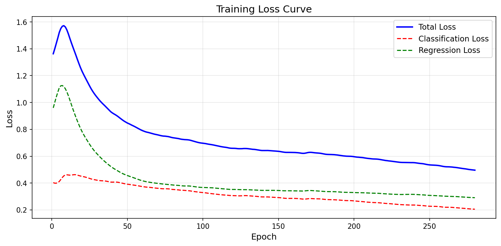
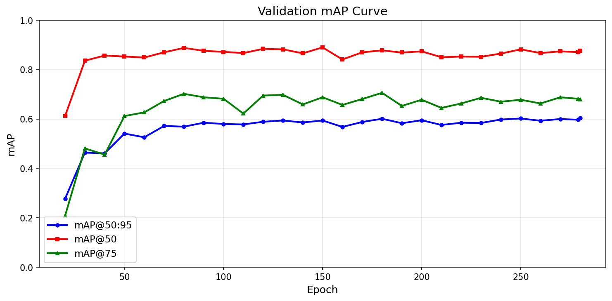

# 基于RTMDet的血液细胞检测与分类系统

<div align="center">

**Blood Cell Detection and Classification Based on RTMDet**


</div>

## 📋 项目简介

本项目基于 **RTMDet-Tiny** 深度学习模型，实现了血液细胞的自动检测与分类。系统可以识别显微镜血液涂片图像中的三类细胞：

- 🔴 **红细胞 (RBC)** — 数量最多的细胞类型
- 🟢 **白细胞 (WBC)** — 免疫系统的重要组成部分
- 🔵 **血小板 (Platelets)** — 参与凝血过程

## 🎯 模型性能

| 指标 | 数值 |
|------|------|
| **mAP@50** | **88.4%** |
| **mAP@50:95** | **61.3%** |
| **mAP@75** | **72.3%** |
| 推理速度 (PyTorch) | 68.3 FPS |
| 推理速度 (ONNX) | 38.1 FPS |

## 📁 项目结构

```
├── configs/rtmdet/
│   └── bccd_rtmdet_tiny_8xb32-300e_coco.py  # 训练配置
├── date/blood_cell/                         # 数据集 (需下载)
│   ├── images/
│   └── annotations/
├── deploy/                                  # 部署相关
│   └── results/                             # ONNX推理结果
├── docs/
│   ├── experiment_report.md                 # 实验报告 (Markdown)
│   ├── experiment_report.docx               # 实验报告 (Word)
│   └── figures/                             # 训练曲线图
├── results/bccd_demo/vis/                   # 检测可视化结果
├── tools/
│   ├── deploy/
│   │   ├── app.py                           # Gradio桌面应用
│   │   ├── export_onnx.py                   # ONNX导出
│   │   ├── onnx_inference.py                # ONNX推理
│   │   └── benchmark.py                     # 性能对比
│   ├── train.py                             # 训练脚本
│   ├── test.py                              # 测试脚本
│   ├── voc2coco.py                          # 数据格式转换
│   └── plot_training.py                     # 训练曲线绘制
└── work_dirs/                               # 训练输出 (需训练)
```

## 🚀 快速开始

### 环境配置

```bash
# 创建conda环境
conda create -n blood_cell python=3.8 -y
conda activate blood_cell

# 安装PyTorch
conda install pytorch torchvision pytorch-cuda=11.8 -c pytorch -c nvidia -y

# 安装mmcv-lite
pip install mmcv-lite==2.1.0 -f https://download.openmmlab.com/mmcv/dist/cu118/torch2.4/index.html

# 安装依赖
pip install mmengine mmdet gradio onnx onnxruntime
```

### 数据准备

```bash
# 下载BCCD数据集
# https://github.com/Shenggan/BCCD_Dataset
# 解压到 BCCD/ 目录

# 转换数据格式
python tools/voc2coco.py
```

### 模型训练

```bash
python tools/train.py configs/rtmdet/bccd_rtmdet_tiny_8xb32-300e_coco.py
```

### 模型测试

```bash
python tools/test.py configs/rtmdet/bccd_rtmdet_tiny_8xb32-300e_coco.py \
    work_dirs/bccd_rtmdet_tiny_8xb32-300e_coco/epoch_280.pth
```

### 推理可视化

```bash
python demo/image_demo.py date/blood_cell/images/test \
    configs/rtmdet/bccd_rtmdet_tiny_8xb32-300e_coco.py \
    --weights work_dirs/bccd_rtmdet_tiny_8xb32-300e_coco/epoch_280.pth \
    --out-dir results/bccd_demo
```

### 启动桌面应用

```bash
python tools/deploy/app.py
# 浏览器访问 http://127.0.0.1:7860
```

### ONNX部署

```bash
# 导出ONNX模型
python tools/deploy/export_onnx.py

# ONNX推理
python tools/deploy/onnx_inference.py --image your_image.jpg

# 性能对比
python tools/deploy/benchmark.py
```

## 📊 训练曲线

<div align="center">

<p>训练损失曲线</p>
</div>

<div align="center">

<p>验证集mAP曲线</p>
</div>

## 🖼️ 检测结果示例

<div align="center">


</div>

## 📄 相关文档

- [实验报告 (Markdown)](docs/experiment_report.md)
- [实验报告 (Word)](docs/experiment_report.docx)

## 🛠️ 技术栈

- **框架**: MMDetection v3.3 + MMEngine 0.10.7
- **模型**: RTMDet-Tiny (CSPNeXt-Tiny Backbone)
- **数据集**: BCCD (364 images, 3 classes)
- **部署**: ONNX Runtime + Gradio

## 📝 引用

```bibtex
@article{rtmdet2022,
  title={RTMDet: An Empirical Study of Designing Real-Time Object Detectors},
  author={Cheng, Cheng and Song, Han and Guo, Yuan and et al.},
  journal={arXiv preprint arXiv:2212.07784},
  year={2022}
}
```

## 📧 联系方式

如有问题，请提交 Issue 或联系项目维护者。

## 🙏 致谢

- [MMDetection](https://github.com/open-mmlab/mmdetection) — OpenMMLab 目标检测工具箱
- [BCCD Dataset](https://github.com/Shenggan/BCCD_Dataset) — 血液细胞检测数据集
- [RTMDet](https://github.com/open-mmlab/mmdetection/tree/main/configs/rtmdet) — 实时目标检测算法
